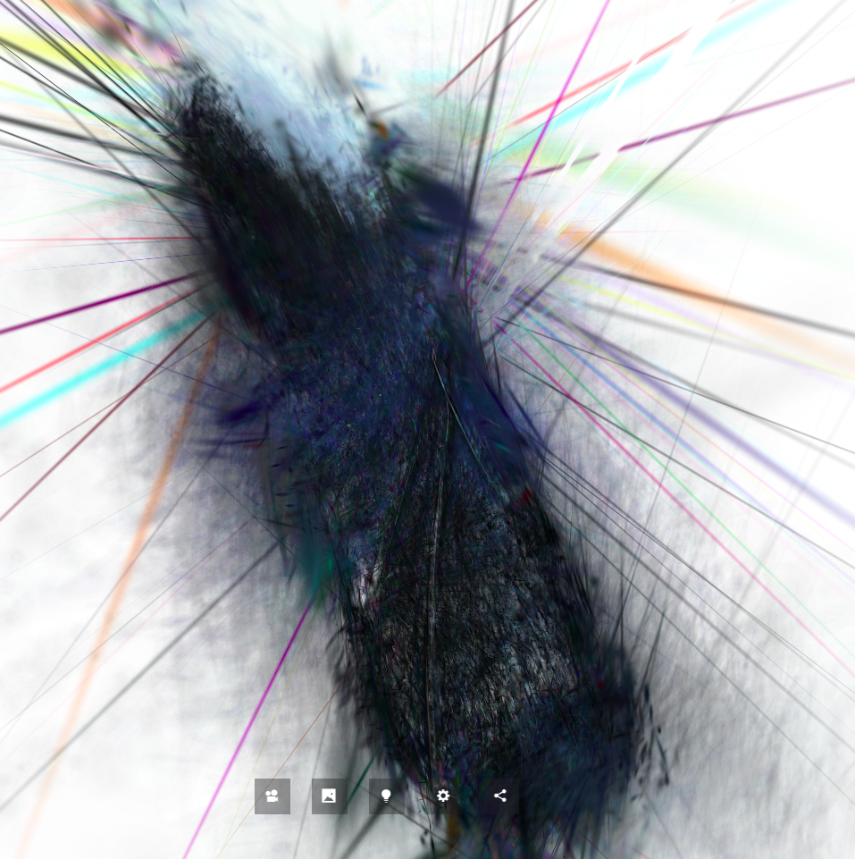
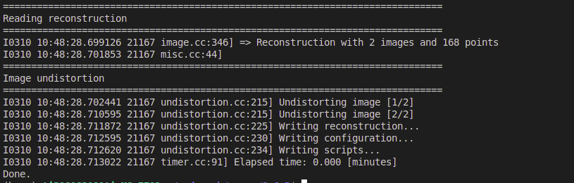
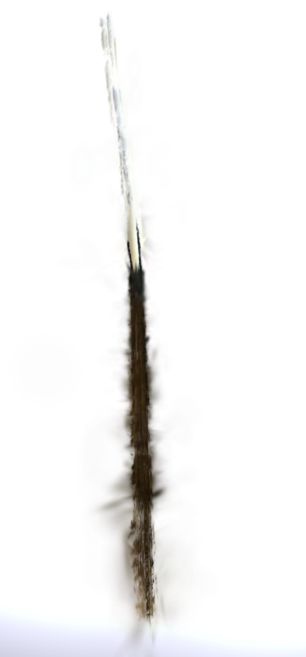
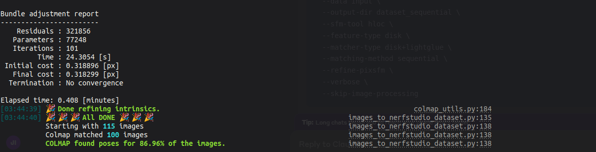
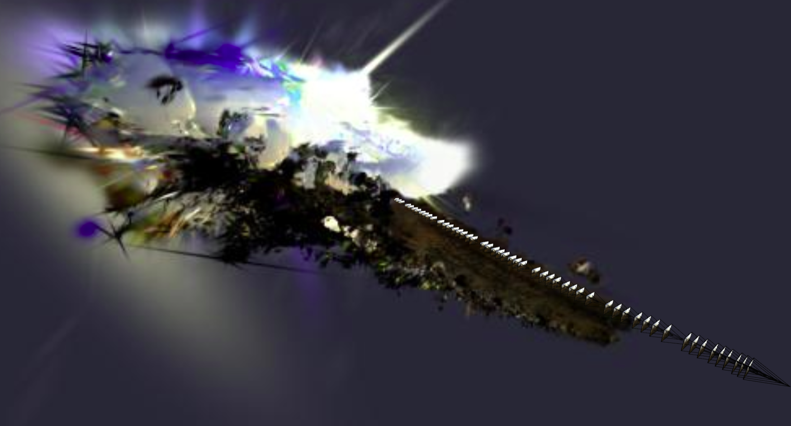
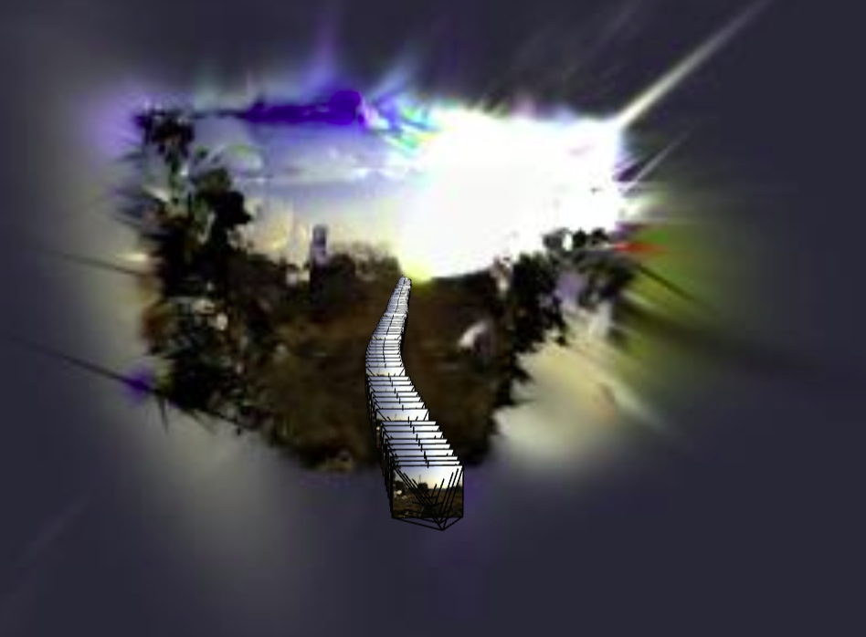
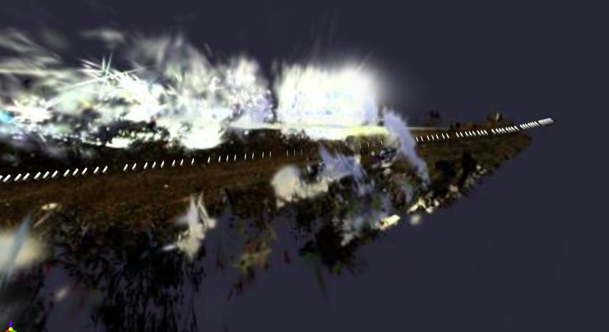

# Setup

First install COLMAP on Ubuntu 20 or 22 via following guidelines [here](https://github.com/superdianuj/colmap_installation_directs).

Then one can run two different resources "inria" and "nerfstudio" for gaussian splatting.

# Oracle (Polycam)
[Polycam](https://poly.cam/) provides Gaussian splatting over an image dataset using their propieratary methods. I use this result as oracle for open source implementations, as in this repo.

<!-- [Oracle Gaussian Splatting](assets/oracle.mp4) -->

[📽️ Oracle Rendering Video](assets/oracle.mp4)

# Observaiton-0 (Inria's Implementation)
When directly convert the video into frames, and using colmap and train script of this repo, I got following results.

# Observation-1 (Inria's Implementation)

The quality of Gaussian splatting goes worse from going from multi-view object scenes, bounded scenes (in door scenes) and out door scenes (out door scenes)

## Comparison of training ground truth and renders

<!-- 
 -->
### Object

[📽️ View Object Rendering Video](assets/compare_renders/vid_object.mp4)

### Bounded Scene

[📽️ View Bounded Scene Rendering Video](compare_renders/vid_officescene.mp4)

### Unbounded Scene

[📽️ View Unbounded Scene Rendering Video](compare_renders/vid_railscene.mp4)

## Reconstruction of 3D Scene

### Object

[📽️ View Object Reconstruction Video](3d_reconsts/object.webm)

### Bounded Scene

[📽️ View Indoor Scene Reconstruction Video](3d_reconsts/bounded.webm)

### Unbounded Scene

[📽️ View Outdoor Scene Reconstruction Video](3d_reconsts/unbounded.webm)

### Hypothesis

1. COLMAP's pose estimation precision impacts performance of Gaussian Splatting

2. Changing hyperparameters impact performance of Gaussian Splatting.

# Observation-2 (Inria's Implementation)
The colmap script in Inria's implementation of gaussian fails to find poses most of the time. Also pose estimation of COLMAP is dependent upon version of colmap used. For example version 3.8 has better performance than 3.11.

For example out of 4000 images, the colmap 3.8 repeatedly found 10/4000 image's poses, while colmap 3.11 found 2/4000 image poses, in 3 trials. 

For the case of colmap 3.11 pose estimation, I got following result of gaussian splatting reconstruction.

## Hypothesis
1. Using older version of colmap may be robust.
2. Creating several crops of each frame with 60 to 80% overlap may improve colmap's routine.

# Observation-3 (Nerfstudio's Implementation)
Nerfstudio is very flexible in adjusting hyperparameters, and I found that pose estimation (candidate 1) there was able to find more than 86 percent of poses. In this case, v3.8 was used when installing colmap

I got following results so far for 3D reconstruction.

## Hypothesis
1. Using sequential, instead of exhausting matching, in COLMAP's SFM routine is faster and more robust. 
2. The candidate 2 for pose estimation using advanced neural feature matching in pose estimation, and is expected to work better.
3. Changing more hyperparameters of Gaussian splatting, or even going for advanced variations of Gaussian splatting may improve fidelity.

